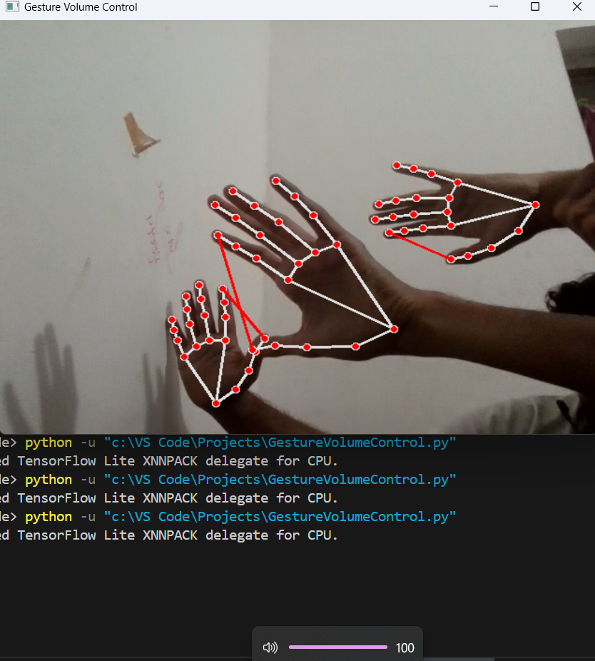

# Gesture-Volume-Control

A Hands-Free Audio Experience
- Tools & technologies used: Python, OpenCV, Mediapipe, Pyautogui
- The Gesture Volume Control project introduces an innovative way to manage audio volume levels using hand
  gestures, providing users with a hands-free and intuitive audio control experience.
- By leveraging computer vision technology and machine learning algorithms, this project enables users to adjust
  the volume of their devices simply by gesturing with their hands in the air.

  
  
